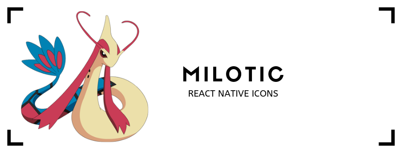

# milotic

An Icon Library for React Native.

[](http://commitizen.github.io/cz-cli/)
[](https://travis-ci.org/skribble-in/milotic)
[](https://codecov.io/gh/skribble-in/milotic)
[](https://www.npmjs.com/package/@skribble/milotic)
[](https://github.com/semantic-release/semantic-release)

<p align="center">
  
</p>

## Installation

```bash
yarn @skribble/milotic react react-native react-native-svg
```

## Dependencies

This package is has peer dependencies of [react](https://github.com/facebook/react), [react-native](https://github.com/facebook/react-native) and [react-native-svg](https://github.com/react-native-community/react-native-svg)

## Usage

```jsx
import { ThumbsUp } from "@skribble/milotic";

export default () => {
  return <ThumbsUp size={35} fill="blue" />;
};
```

## Props

Icons have the default SVG Props inherited from ["react-native-svg"](https://github.com/react-native-community/react-native-svg/blob/235ded3d09e1b0a05957d3ba8a42424916d34f38/index.d.ts#L313) and an additional **size** prop to set the height and width of the icon.
